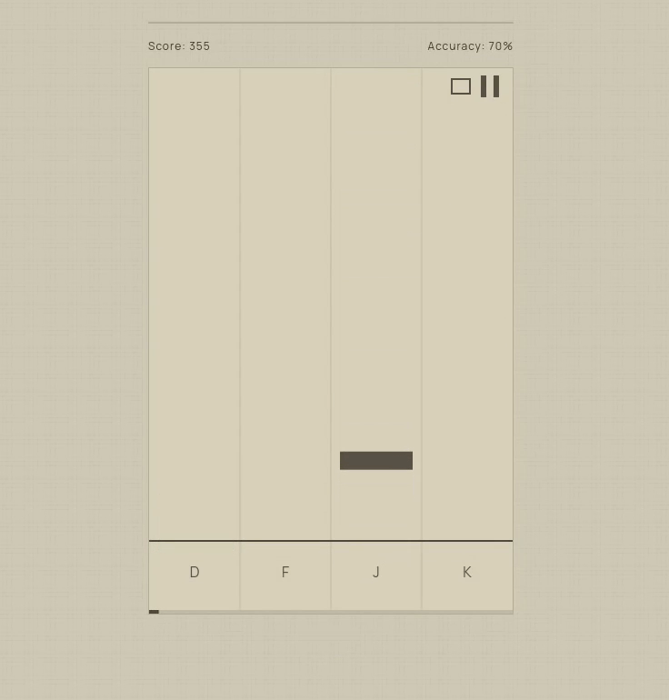

# **[Rhythm-YoRHa](https://rhythm-yorha.pages.dev)**

A web-based rhythm game similar to Dance Dance Revolution or Osu!Mania that generates levels from any uploaded audio file with unique beatmaps for every new attempt.

**Design system is inspired by the YoRHa-UI from Nier: Automata, written for tailwind.**

**[Demo URL:](https://rhythm-yorha.pages.dev) <https://rhythm-yorha.pages.dev/>**



## How to Run

```bash
git clone https://github.com/numinousv/rythm-spel.git
cd rythm-spel
bun install
bun run dev
```

Open `http://localhost:5173` in your browser.

## How to Play

1. Upload an audio file (MP3, WAV, OGG, etc.)
1. Choose a difficulty: Easy, Medium, Hard, or Extreme
1. Hit **D, F, J, K** in time with the music as notes scroll down, or if on mobile, simply tap the lanes where the notes appear.
1. View your results: score, accuracy, max combo, and a letter grade (S/A/B/C/D)
1. Retry for a new randomized variation, or go back and try a different song

Your last song is saved automatically — you can return and play it again later.

## How It Works

**Beat Detection** — The audio is decoded via the Web Audio API, then an energy-based peak detection algorithm identifies beats by comparing each chunk's energy against a local average window. Detected beats become note spawn points.

**Level Generation** — Each playthrough randomly selects which beats become notes and assigns them to one of four lanes, so no two runs feel the same. Difficulty controls note density and scroll speed.

**Scoring** — Timing accuracy per hit determines points, with a combo multiplier that increases every 10 consecutive hits.

## Tech Stack

- **Language:** TypeScript
- **Framework:** React 19
- **Bundler:** Vite
- **Routing:** React Router
- **Rendering:** HTML5 Canvas (2D)
- **Styling:** Tailwind CSS 4
- **Audio:** Web Audio API (custom beat detection)
- **Storage:** IndexedDB (audio blobs), localStorage (metadata)

## Known Issues

- Very large uncompressed WAV files (5MB+) may exceed storage limits
- Beat detection works best with rhythmic music; ambient or classical tracks may produce sparse note maps
